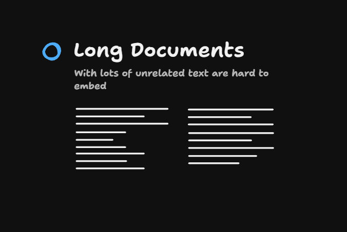
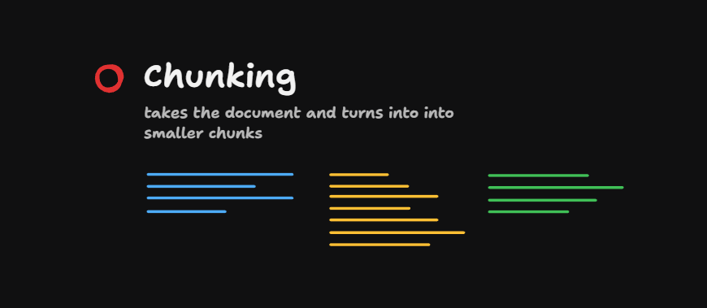
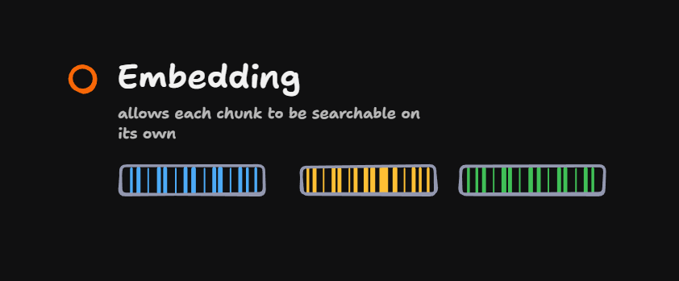

So far, we have been making a rather dangerous assumption about the data that we are pulling into our retrieval system. We have been assuming that all of the documents that we've been receiving, whether that's emails or notes, are going to be of a relatively regular size.

In other words, most emails you get are going to be just like a few paragraphs or less. But in the real world, that doesn't happen.

## Real-World Document Sizes

Some documents, of course, are really, really short, but some are the size of novels. If you have a huge survey report delivered to you via email, how are you going to make that searchable?

Because a large document like that, if you pull it in through a retrieval algorithm, it's going to dominate the context window. And even if there is relevant information in there, you're giving the LLM a really hard job because it becomes a needle in a haystack problem.

Whenever we're working with an LLM, you want to give it really focused context. And so we need to find a way to handle these large documents which are going to be such a problem for our current system.

So we need to talk about chunking.

## The Problem: Long Documents

Long documents with lots of unrelated text are hard to embed. If you have some key information in a long document, it's going to get crowded out by all the other unrelated information.

## The Solution: Break Documents Into Chunks

Taking that document and splitting it into chunks will be really beneficial. Each of these smaller chunks of the document can then be treated and searched for independently.

And instead of making one big embedding for the entire document, we can take parts of the document and create individual embeddings for them.

In this section, we're going to talk a lot about chunking because it's a key skill in any retrieval-based setup.
